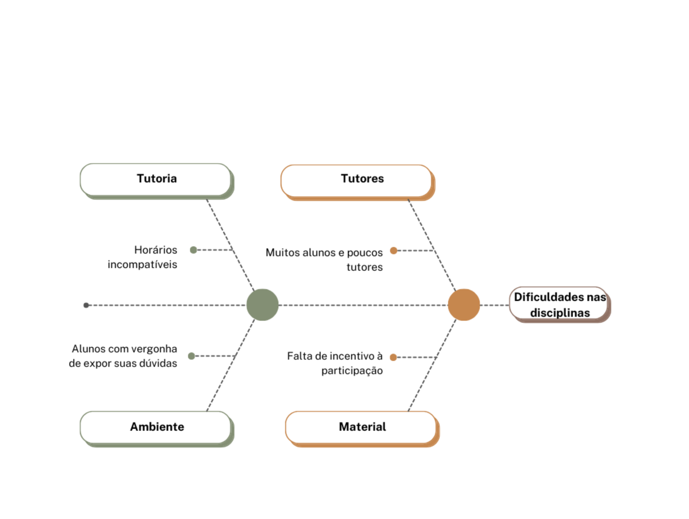
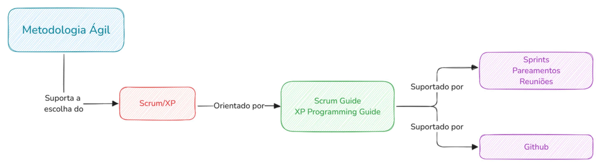
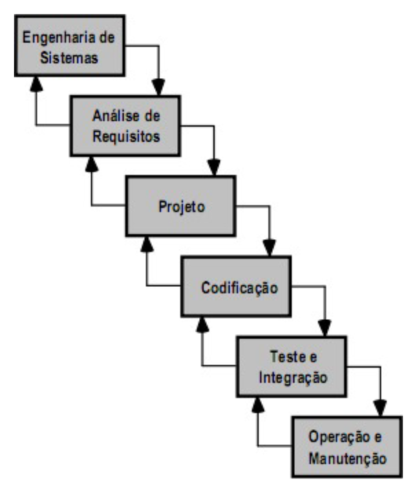

**Integrantes do Grupo:**

| Mat.      | Nome                                   | Função (responsabilidade) |
| :-------- | :------------------------------------- | :------------------------ |
| 231027032 | ARTHUR EVANGELISTA DE OLIVEIRA         | Desenvolvedor Front-End   |
| 232001649 | DAVID WILLIAM LEMOS FERREIRA           | DevOps                    |
| 232013980 | GABRIEL ANDRADE MAGIOLI                | Desenvolvedor Back-End    |
| 231038644 | GIOVANA DE SOUZA FONTES                | Desenvolvedora Front-End  |
| 222008691 | GUSTAVO RIBEIRO LINHARES               | Desenvolvedor Front-End   |
| 221022604 | JOÃO VICTOR DA SILVA BATISTA DE FARIAS | DevOps                    |
| 231035455 | LETICIA MARIA DE JESUS LOPES           | Desenvolvedora Front-End  |
| 231026886 | SOPHIA SOUZA DA SILVA                  | Desenvolvedora Back-End   |
| 231011865 | WILLIAN WAGNER XAVIER RAMOS DA SILVA   | Desenvolvedor Back-End    |
| 231038303 | YAN MATHEUS SANTA BRIGIDA DE AGUIAR    | Desenvolvedor Front-End   |

**Histórico de Revisões**

| Data           | Versão | Descrição                    | Autor                         |
| :------------- | :----- | :--------------------------- | :---------------------------- |
| **24/11/2024** | 0.1    | Primeira versão do documento | David, Gabriel, João e Sophia |

## **VISÃO GERAL DO PRODUTO**
### **Problema**
Em uma comunidade acadêmica, é comum haver monitorias/tutorias das disciplinas oferecidas pela instituição, para que os estudantes possam tirar suas dúvidas sobre determinados assuntos com um tutor. Porém, muitas vezes esse contato não ocorre, seja por conta de incompatibilidade de horário ou outros motivos, e, com um software que possibilite à comunidade que essas dúvidas sejam postadas a qualquer momento e que qualquer membro que possua o conhecimento possa saná-las, podemos mitigar esse problema e promover a colaboração e o desenvolvimento dos alunos.

Figura 1: Diagrama espinha de peixe

### **Declaração de Posição do Produto** 

Nosso software visa solucionar um problema presente na comunidade acadêmica da FCTE, segue abaixo nossa declaração de posição.

Tabela 1: Declaração de posição do produto

|                          Para: | Estudantes da UnB campus Gama \- FCTE                                                                                                                                                                                  |
| -----------------------------: | :--------------------------------------------------------------------------------------------------------------------------------------------------------------------------------------------------------------------- |
|                   Necessidade: | A comunidade estudantil precisa de tutores para tirar dúvidas sobre determinados assuntos que estão estudando.                                                                                                         |
<!-- TODO: Change mobile app name -->
| O Wunjo \- Tutoria Gamificada: | é um aplicativo mobile chamado Wunjo \- A aventura do conhecimento.                                                                                                                                                  |
|                           Que: | Facilita aos estudantes comunicarem suas dúvidas e serem ajudados por qualquer membro da comunidade que possua o conhecimento de forma simples e prática.                                                              |
|                  Ao contrário: | Muitos alunos não conseguem participar de monitorias/tutorias por conta de horários incompatíveis, vergonha ou outros motivos, e acabam ficando com suas dúvidas não resolvidas.                                       |
|                 Nosso produto: | Nosso aplicativo permite que os estudantes possam expressar suas dúvidas a qualquer momento e ajudarem um ao outro, sem exposição, em um ambiente gamificado para incentivá-los e tornar a experiência mais divertida. |

### **Objetivos do Produto**

O projeto possui por objetivo principal o desenvolvimento de uma plataforma voltada aos alunos da UnB - campus Gama para que seja criado um ambiente colaborativo e motivador, assim, aumentando a interação e desenvolvimento acadêmico entre os alunos. A plataforma irá utilizar, por meio de ferramentas de gamificação, formas para aumentar a navegabilidade, experiência do usuário e interação entre aluno e tutor.

### **Tecnologias utilizadas**
#### **Tecnologias**  
As tecnologias foram escolhidas com base em suas grandes bases de documentações e comunidades, sendo assim, mais simples encontrar material de apoio durante o desenvolvimento.

- JavaScript/Typescript
- NodeJs
- ExpressJs
- React Native
- PostgreSQL
- Prisma ORM
- DBeaver
- Docker

As tecnologias Typescript, NodeJs, ExpressJs, React Native contam com uma ampla disponibilidade de bibliotecas que facilitam o desenvolvimento de novas funcionalidades e otimizam o tempo durante o desenvolvimento, além disso são tecnologias que funcionam com uma alta performance.  
Como banco de dados foi decidido o uso do PostgreSQL devido ao amplo suporte para adicionar novos tipos de dados, funções e possuir um alto desempenho. Para seu manuseio será utilizado o Prisma ORM, assim facilitando as operações entre a API e o Banco de Dados.  
Foi escolhido utilizar o Docker visto que possui diversas imagens que irão facilitar durante o desenvolvimento, como a do postgreSQL que poderá ser usada junto ao DBeaver ao invés de armazenar um banco localmente durante o desenvolvimento. Além disso, irá garantir que a aplicação vá rodar da maneira esperada em diversas máquinas, sem haver problema de interoperacionalidade.

#### **Ferramentas**

- GitHub
- Git

As ferramentas Git e Github foram escolhidas para que o código e documentos possam ser versionados e guardados dentro de um repositório, contam com um extenso material na internet, assim, facilitando com que todos os integrantes da equipe consigam aprender facilmente a utilizar. Além disso, o Git possui um histórico de versionamento, o que facilita recuperar trechos do código caso alguma funcionalidade seja implementada de forma indevida. O GitHub possui funcionalidades que contribuem com a organização da equipe, facilitando na atribuição e organização de tarefas.

#### **Métodos**  
Os métodos de desenvolvimento escolhidos pela equipe foram o Scrum e o XP.

- Scrum

O Scrum irá facilitar no andamento do projeto devido a alta adaptabilidade às mudanças ao decorrer do projeto, entregas e validação constante com o cliente referente ao produto de software, e também, o fácil gerenciamento de uma equipe multidisciplinar.

- XP

O XP será utilizado devido a ferramentas como o *pair programming*, visto que irá agilizar o desenvolvimento e aprendizado dos membros da equipe, além da constante comunicação e feedbacks que serão utilizados internamente na equipe para possíveis melhoras durante o desenvolvimento do projeto.

#### **Arquitetura**  
**Backend:**  

- **Hexagonal:** No backend foi optado pelo uso da arquitetura hexagonal, pois assim, haverá uma forte divisão entre as camadas mais internas da aplicação com as mais externas, será aplicada uma forte inversão de dependência, visando uma maior organização e estruturação para o crescimento da plataforma a longo prazo, facilitando sua manutenção. A arquitetura hexagonal é baseada em portas, que são as partes da aplicação que irão receber requisições externas para envio de dados, e adaptadores, que funcionam como uma camada intermediária entre a camada de serviços da aplicação e serviços externos que serão utilizados na API.

**Frontend:**

- **Component-Based Architecture:** No frontend optamos pelo uso da arquitetura CBA(Component-Based Architecture). A arquitetura CBA visa segregar o código em pequenos componentes independentes que combinados formam a interface, aproveitando o comportamento natural do React utilizaremos a CBA para criar componentes reutilizaveis, promovendo a qualidade de código, manutenibilidade, a organização na equipe e a testabilidade do software.  

## **VISÃO GERAL DO PROJETO**

### **Ciclo de vida do projeto de desenvolvimento de software**

Figura 2: Ciclo de vida do projeto

Durante o desenvolvimento desse projeto utilizaremos a metodologia ágil SCRUM e os métodos de desenvolvimento do Extreme Programming (XP). Nesse contexto, a utilização desses dois frameworks surge na necessidade estratégica de guiar o gerenciamento do trabalho e a execução técnica das atividades. O SCRUM prioriza a organização da equipe por meio de sprints, reuniões, revisões e retrospectivas, enquanto XP adiciona práticas de engenharia como programação em pares, testes e integração contínua, visando garantir a qualidade técnica no desenvolvimento.  
Essas metodologias são fundamentadas por guias consolidados, como o Scrum Guide e XP Programming Guide, que servem como referências para implementar suas abordagens.  
Para apoiar essas práticas, ferramentas como o Github — que é uma plataforma de controle de versão e colaboração — traz um papel fundamental. O Github facilita a organização do código, rastreamento de problemas e a integração contínua, permitindo que a equipe trabalhe de forma eficiente e integrada. Além disso, o uso de tecnologias e técnicas modernas e as pipelines de integração contínua e entrega contínua (CI/CD) asseguram o processo de desenvolvimento ágil, iterativo e de alta qualidade.  
Por fim, é notório que a utilização de todos esses frameworks combinam os valores e princípios da agilidade com ferramentas e práticas que promovem a entrega de valor incremental, permitindo que equipes adaptem-se rapidamente às mudanças e garantam qualidade e alinhamento com os objetivos do projeto.

### **Organização do Projeto**

Tabela 2: Divisão de responsabilidades

| Papel                   | Atribuições                                                                                                                                                                       | Responsável      | Participantes                                                          |
| :---------------------- | :-------------------------------------------------------------------------------------------------------------------------------------------------------------------------------- | :--------------- | :--------------------------------------------------------------------- |
| Desenvolvedor front-end | Idealizar design do produto, codificar a interface, codificar testes unitários, realizar refatoração, gerar análise de usuários, construir Plano Geral da Gamificação, documentar | David William    | Arthur, David William, Giovana, Gustavo, João V. Farias, Yan, Letícia, |
| Desenvolvedor back-end  | Modelar e codificar banco de dados, codificar testes unitários, realizar refatoração, documentar                                                                                  | David William    | David William, Gabriel, João V. Farias, Sophia                         |
| Desenvolvedor devops    | Integrar back-end e front-end, codificar testes unitários, realizar refatoração, documentar, distribuir produto, manter infraestrutura através de monitoramento                   | David William    | David William, João V. Farias                                          |
| Líder do Produto        | Junto aos times, atualizar o escopo do produto, organizar o escopo das sprints, validar as entregas                                                                               | David William    | Gabriel                                                                |
| Cliente                 | Definir requisitos, fornecer feedback, priorizar funcionalidades, aprovar entregas, comunicar restrições, participar de reuniões                                                  | Wildemberg Sales |                                                                        |

### **Planejamento das Fases e/ou Iterações do Projeto**

Tabela 3: Planejamento do projeto

| _Sprint_ | _Produto (Entrega)_     | _Data Início_ | _Data Fim_ | _Entregável(eis)_                               | _Responsáveis_   | _% conclusão_ |
| -------- | ----------------------- | ------------- | ---------- | ----------------------------------------------- | ---------------- | ------------- |
| 1        | Definição do Produto    | 08/11/24      | 22/11/24   | Documento de requisitos                         | Equipe e Cliente | 50%           |
| 2        | Planejamento do Projeto | 23/11/24      | 06/12/24   | Documento de visão e Plano Geral da Gamificação | Equipe           | 50%           |

### **Matriz de Comunicação**

Tabela 4: Matriz de comunicação

| Descrição                                                                         | Área/Envolvidos | Periodicidade         | Produtos Gerados                                                                             |
| :-------------------------------------------------------------------------------- | :-------------- | :-------------------- | :------------------------------------------------------------------------------------------- |
| Validação de requisitos                                                           | Cliente Equipe  | Sempre que necessário | Documento de requisitos e gamificação.                                                       |
| Acompanhamento das atividades; Acompanhamento dos compromissos e ações pendentes. | Equipe          | Semanal               | Ata de reunião; Relatórios; Atividades a serem realizadas; Documento de visão e arquitetura. |
|                                                                                   | Equipe          | Quinzenal             |                                                                                              |
| Entrega de funcionalidade.                                                        | Cliente Equipe  | A cada sprint         | Ata de reunião.                                                                              |
| Comunicar situação do projeto                                                     | Equipe Monitor  | Semanal               | Ata de reunião.                                                                              |

### **Gerenciamento de Riscos**

Tabela 5: Gerenciamento de riscos

| Risco                                                                                                                   | Mitigação                                                                                      | Contingência                                                                                                                                                       | Grau  |
| :---------------------------------------------------------------------------------------------------------------------- | :--------------------------------------------------------------------------------------------- | :----------------------------------------------------------------------------------------------------------------------------------------------------------------- | :---- |
| Erros nas queries do Prisma ORM, resultando em problemas de performance no banco de dados.                              | Realizar code reviews dedicados às queries e implementar monitoramento de desempenho do banco. | Revisar e refatorar as queries mais críticas em produção com suporte das métricas de monitoramento.                                                                | Alto  |
| Falhas na segurança do chat, expondo dados dos usuários a terceiros mal-intencionados.                                  | Adotar criptografia end-to-end no chat e realizar testes de segurança periódicos.              | Bloquear temporariamente o acesso ao chat enquanto as vulnerabilidades são corrigidas.                                                                             | Alto  |
| Excesso de dependência dos DevOps, atrasando a entrega do projeto em caso de indisponibilidade dessas pessoas.          | Documentar claramente o setup de infraestrutura e automação de deploys.                        | Treinar outros integrantes do back-end para dar suporte básico às tarefas de DevOps.                                                                               | Alto  |
| Falha na sincronização de dados entre o servidor e o aplicativo, resultando em inconsistências no ranking ou pontuação. | Implementar testes de integração automáticos para validar as sincronizações periodicamente.    | Configurar notificações para alertar quando houver falhas na sincronização, e alocar temporariamente um desenvolvedor para corrigir manualmente os dados afetados. | Alto  |
| Falhas na gamificação desmotivando os usuários, como mecânicas de pontuação mal calibradas.                             | Realizar testes com usuários para ajustar o equilíbrio de pontos e níveis antes do lançamento. | Atualizar os parâmetros de pontuação em tempo real e comunicar as mudanças aos usuários.                                                                           | Médio |
| Desempenho inadequado do aplicativo em dispositivos mais antigos                                                        | Realizar testes de performance com diferentes configurações de hardware.                       | Desativar funcionalidades mais pesadas nesses dispositivos, priorizando a experiência básica.                                                                      | Médio |
| Dificuldade na gestão de backlog no GitHub Projects, resultando em baixa rastreabilidade das tarefas.                   | Treinar o time para utilizar corretamente as ferramentas e revisar o backlog regularmente.     | Dar responsabilidade para um membro supervisionar as tarefas e padronizar templates para as issues.                                                                | Médio |

### **Critérios de Replanejamento**

Para situações em que os riscos demonstram uma ameaça direta à entrega dos objetivos principais ou quando acumulam-se fatores que podem gerar um débito técnico significativo; nós planejamos caso haja **falhas de sincronização críticas entre o servidor e o aplicativo**, pois inconsistências nos rankings ou pontuações afetam diretamente a experiência central de gamificação. Logo, resolver esse problema será essencial para evitar que o acúmulo de erros no banco de dados gera retrabalho em fases posteriores.

Uma outra possível situação é **falha (de segurança ou não) do chat entre tutor e aluno**, requer reavaliação imediata do escopo, pois expõe a aplicação a riscos legais e de confiança do usuário. Esses casos demandam alocação de recursos de forma urgente, mesmo que em detrimento de funcionalidades menos prioritárias, como a própria gamificação. Pois o aplicativo ser funcional é de suma importância.

Desta forma garantimos que as entregas sejam consistentes e escaláveis ao preservar a saúde do projeto ao longo deste tempo.

## **PROCESSO DE DESENVOLVIMENTO DE SOFTWARE**

As metodologias escolhidas para o desenvolvimento de software foram SCRUM e XP devido a agilidade que possibilita no desenvolvimento do produto de software, garantindo qualidade, assertividade, através das validações constantes com o cliente, e o aprendizado e acompanhamento constante do grupo através  da programação por pares. Será utilizada uma abordagem iterativa e incremental, onde será apresentado constantemente o desenvolvimento do software ao cliente e também funcionalidades já consideradas prontas para uso.
  

Figura 3: Fluxo de trabalho

## **DECLARAÇÃO DE ESCOPO DO PROJETO**

### **Backlog do produto**

A forma na qual foi feita a elicitação de requisitos foi através de uma reunião via Microsoft Teams onde a equipe entendeu através de um brainstorm o problema que o cliente busca resolver, durante a reunião foram feitas diferentes perguntas para entender as funcionalidades do software e também o que a gamificação deveria motivar os usuários do software a fazer.

**OBS.:** A plataforma possui apenas um tipo de usuário que são os alunos da UnB, mas são chamados de tutor quando estão na posição de alguém que tira dúvida, e são chamados de alunos quando na posição de quem pergunta.

**Como aluno eu quero:**

- Publicar minhas dúvidas em um fórum de dúvidas público para qualquer pessoa me responder de forma privada.(RQ01 \- MUST)
- Cancelar um bate-papo de dúvidas já iniciado com um tutor, com um limite de 3 cancelamentos por semana. (RQ04 \- SHOULD)
- Marcar uma dúvida como concluída removendo-a do fórum de dúvidas após ser sanada por um tutor.(RQ09 \- MUST)
- Cadastrar minhas dúvidas no fórum indicando a matéria, complexidade e urgência. (RQ10, RQ11 \- MUST)
- Postar minhas dúvidas em formato de texto e/ou foto.(RQ12 \- MUST)
- Avaliar o atendimento do tutor, dando a ele uma nota, após ter a conversa finalizada.(RQ14 \- MUST)
- Ter a possibilidade de deletar minha conta. (RQ27 \- MUST)
- Receber uma notificação quando um tutor entrar em contato comigo para tirar uma dúvida. (RQ31 \- MUST)
- Editar meu perfil escolhendo se quero ou não participar do ranking e alterar outras informações pessoais. (RQ32 \- MUST)

**Como tutor eu quero:**

- Selecionar uma dúvida que está no fórum de dúvidas e responder privadamente.(RQ02 \- MUST)
- Cancelar um bate-papo de dúvidas sem ser penalizado e sem que haja um limite de cancelamentos.(RQ03 \- SHOULD)
- Filtrar dúvidas por dificuldade, por matéria e também por urgência no fórum de dúvidas.(RQ07, RQ13 \- MUST)
- Receber recompensas de acordo com meu desempenho na plataforma. (RQ23 \- MUST)
- Ter a possibilidade de deletar minha conta. (RQ27 \- MUST)
- Ver um mural de conquistas com informações sobre quantas pessoas conseguir ajudar, minhas médias e pontuação total. (RQ29 \- MUST)

**Como sistema eu quero:**

- Reiniciar a contagem de cancelamentos semanais que um aluno pode fazer de um bate-papo de dúvidas.(RQ05 \- SHOULD)
- Possuir um bate-papo privado para que os alunos tirem suas dúvidas entre si.(RQ06 MUST)
- Buscar as matérias ofertadas na UnB/FCTE através de web-scraping.(RQ08 \- MUST)
- Permitir os usuários a fazer denúncias em caso de comportamento impróprio de outro usuário na plataforma. (RQ15 \- COULD)
- Possuir uma gamificação que incentive a interação e melhore o aprendizado dos alunos. (RQ16 \- MUST)
- Possuir um ranking dos alunos que usam a plataforma. (RQ17, RQ33 \- MUST)
- Dar a possibilidade de o usuário escolher ou não aparecer no ranking. (RQ18 \- MUST)
- Privar um tutor de responder dúvidas por 3 dias em caso de comportamento inadequado ou avaliação muito baixa nos atendimentos. (RQ19 \- SHOULD)
- Permitir que usuários se cadastrem na plataforma através de uma matrícula, curso e senha.(RQ20 \- MUST)
- Aumentar o valor a ser recebido por responder uma dúvida após períodos de tempo serem passados, a depender da complexidade da pergunta selecionada pelo aluno. (RQ21 \- SHOULD)
- Dar um valor maior a perguntas de maior dificuldade(RQ22 \- COULD)
- Retirar moedas/ pontos dos tutores com baixa avaliação. (RQ25 \- COULD)
- Enviar notificações por email para o usuário que recebeu uma denúncia sobre seu comportamento. (RQ26- SHOULD)
- Manter os chats de dúvidas dos usuários. (RQ28 \- COULD)
- Enviar notificações com recomendações de dúvidas com maior pontuação ou urgência que ainda estão em aberto. (RQ30 \- COULD)
- Enviar para o email institucional, a partir da matrícula fornecida no cadastro, um link para confirmação de cadastro do usuário. (RQ34 \- MUST)
- Possuir uma gamificação dividida em temporadas com duração de 6 meses. (RQ35 \- MUST)

### **Perfis**

Tabela 6: Perfis de acesso

| \#  | Nome do perfil | Características do perfil                                              | Permissões de acesso                                        |
| :-- | :------------- | :--------------------------------------------------------------------- | :---------------------------------------------------------- |
| 1   | Aluno          | Responsável por fazer as perguntas sobre suas dúvidas. (Abrir dúvidas) | Abrir dúvidas, ler dúvidas, fechar dúvidas, avaliar dúvidas |
| 2   | Tutor          | Responsável por responder às dúvidas do aluno. (Solucionar dúvidas)    | Ler dúvidas, responder dúvidas.                             |

### **Cenários**

Tabela 7: Cenários funcionais

| Sistema: Wunjo – Cenários funcionais |                 |         |
| :--------------------------------: | :-------------: | :-----: |
|        Numeração do cenário        | Nome do cenário | Sprints |
|               1                    | Criação de conta|    1    |
|               2                    | Postar dúvida   |    1    |

### **Tabela de Backlog do produto**

Tabela 8 : Backlog do produto

<!-- TODO: Change system name -->
| Sistema: Wunjo – Backlog do produto |        |                               |                   |             |                                                                                                                                                                                              |                                    |
| ------------------------------------- | :----- | :---------------------------- | ----------------- | :---------- | :------------------------------------------------------------------------------------------------------------------------------------------------------------------------------------------- | ---------------------------------- |
| Nº                                    | Sprint | Nome                          | Tipo de requisito | Priorização | Descrição sucinta do requisito                                                                                                                                                               | **User stories (U.S.) associadas** |
| 1                                     |        | Fórum público                 | Funcional         | Must        | Possuir um fórum de dúvidas público onde os alunos publiquem suas dúvidas                                                                                                                    |                                    |
| 2                                     |        | Responder dúvidas             |                   | Must        | Um tutor pode selecionar uma dúvida do fórum para responder em um chat privado entre os dois usuários.                                                                                       |                                    |
| 3                                     |        | Cancelar chat \- Tutor        |                   | Should      | Tutor pode cancelar um bate-papo quantas vezes quiser                                                                                                                                        |                                    |
| 4                                     |        | Cancelar chat \- Aluno        |                   | Should      | O aluno que está fazendo uma pergunta pode cancelar os chats privados 3 vezes por semana.                                                                                                    |                                    |
| 5                                     |        | Contagem de cancelamentos     |                   | Should      | Reiniciar a contagem de cancelamentos que um aluno pode fazer a cada 7 dias.                                                                                                                 |                                    |
| 6                                     |        | Chat privado                  |                   | Must        | Deve haver chats privados entre os alunos e tutores.                                                                                                                                         |                                    |
| 7                                     |        | Filtrar por matéria           |                   | Must        | Possuir filtro de dúvidas por matéria.                                                                                                                                                       |                                    |
| 8                                     |        | Busca                         |                   | Must        | O sistema deverá buscar as matérias através do SIGAA.                                                                                                                                        |                                    |
| 9                                     |        | Dúvida resolvida              |                   | Must        | Após a dúvida ser sanada, o usuário deve marcar como resolvida para fechar a questão.                                                                                                        |                                    |
| 10                                    |        | Urgência da questão           |                   | Must        | Usuário cadastra suas dúvidas indicando qual matéria se trata e a urgência                                                                                                                   |                                    |
| 11                                    |        | Nível de dificuldade          |                   | Must        | Usuários cadastram a dificuldade da dúvida (Alta, Média, Baixa).                                                                                                                             |                                    |
| 12                                    |        | Formatos aceitos              |                   | Must        | As dúvidas podem ser colocadas em forma de texto e/ou foto.                                                                                                                                  |                                    |
| 13                                    |        | Filtrar por urgência          |                   | Must        | Possuir filtro de dúvidas por urgência.                                                                                                                                                      |                                    |
| 14                                    |        | Avaliação do tutor            |                   | Must        | Aluno avalia o tutor após o atendimento para que a dúvida seja fechada.                                                                                                                      |                                    |
| 15                                    |        | Denúncia                      |                   | Could       | Usuários podem fazer denúncias em caso de comunicação imprópria, agressão e uso indevido da plataforma.                                                                                      |                                    |
| 16                                    |        | Gamificação                   |                   | Must        | O sistema deve ser gamificado.                                                                                                                                                               |                                    |
| 17                                    |        | Ranking                       |                   | Must        | Deve haver um ranking dos alunos.                                                                                                                                                            |                                    |
| 18                                    |        | Participação                  |                   | Must        | O usuário pode escolher participar ou não do ranking.                                                                                                                                        |                                    |
| 19                                    |        | Restrição                     |                   | Should      | O Tutor é temporariamente restringido de responder dúvidas caso suas respostas sejam frequentemente reportadas como incorretas ou tenha uma avaliação muito baixa, por um período de 3 dias. |                                    |
| 20                                    |        | Cadastro                      |                   | Must        | Usuário se cadastra com nome, matrícula e curso (da FCTE).                                                                                                                                   |                                    |
| 21                                    |        | Pontos por tempo sem resposta |                   | Should      | Aumentar as moedas das dúvidas de acordo com o tempo sem resposta, tornando-as mais atrativas.                                                                                               |                                    |
| 22                                    |        | Pontos por dificuldade        |                   | Could       | Aumentar as moedas das dúvidas de acordo com o nível de dificuldade.                                                                                                                         |                                    |
| 23                                    |        | Recompensas                   |                   | Must        | Recompensar tutores com moedas de acordo com seu desempenho e participação.                                                                                                                  |                                    |
| 24                                    |        | Trocas de moedas              |                   | Must        | O usuário pode trocar suas moedas por medalhas.                                                                                                                                              |                                    |
| 25                                    |        | Perda de moedas               |                   | Could       | Tutores perdem moedas conforme a avaliação ruim de um aluno sobre seu atendimento.                                                                                                           |                                    |
| 26                                    |        | Alerta                        |                   | Should      | Enviar e-mail para o usuário denunciado para alertar sobre denúncias de comportamento impróprio.                                                                                             |                                    |
| 27                                    |        | Deletar conta                 |                   | Must        | O usuário pode deletar sua conta.                                                                                                                                                            |                                    |
| 28                                    |        | Visualizar chats              |                   | Could       | O sistema deve manter os chats privados dos usuários.                                                                                                                                        |                                    |
| 29                                    |        | Mural do usuário              |                   | Must        | Possuir mural de conquistas onde o usuário pode ver suas medalhas, moedas, mostrar quantas vezes ele ajudou as pessoas, mostrar a média geral do tutor.                                      |                                    |
| 30                                    |        | Notificação de dúvidas        |                   | Could       | O sistema deve enviar notificações indicando dúvidas em aberto.                                                                                                                              |                                    |
| 31                                    |        | Notificação de chat           |                   | Must        | Notificar o aluno quando um tutor iniciar chat privado respondendo sua dúvida.                                                                                                               |                                    |
| 32                                    |        | Editar perfil                 |                   | Must        | Usuário pode editar nome, curso e status de participação no ranking.                                                                                                                         |                                    |
| 33                                    |        | Exibir no ranking             |                   | Must        | Exibir no ranking dos tutores cada tutor junto de suas médias e quantidade de atendimentos.                                                                                                  |                                    |
| 34                                    |        | Validar cadastro              |                   | Must        | O sistema recebe a matrícula do aluno e envia para o email institucional uma validação de cadastro.                                                                                          |                                    |
| 35                                    |        | Temporadas                    |                   | Must        | O sistema possui temporadas com duração de 6 meses onde os rankings são reiniciados após esse tempo.                                                                                         |                                    |
| 36                                    |        | Público-alvo                  | Não funcional     | Must        | Tem como foco os alunos da UnB.                                                                                                                                                              |                                    |
| 37                                    |        | Requisições                   |                   | Must        | O sistema deve suportar alta quantidade de requisições                                                                                                                                       |                                    |
| 38                                    |        | Usabilidade                   |                   |             | O sistema deve ser intuitivo e de fácil navegação.                                                                                                                                           |                                    |
| 39                                    |        | Segurança                     |                   | Must        | O sistema deve armazenar dados de maneira segura, respeitando a privacidade e a proteção das informações dos alunos.                                                                         |                                    |
| 40                                    |        | Nome de usuário               |                   | Must        | O sistema deve utilizar a matrícula dos alunos como nome de usuário.                                                                                                                         |                                    |
| 41                                    |        | Foto de perfil                |                   | Should      | O sistema deve permitir que o usuário selecione uma foto de perfil caso queira utilizar.                                                                                                     |                                    |
| 42                                    |        | Velocidade                    |                   | Must        | O sistema deve possuir rápida atualização das mensagens entre os tutores e alunos.                                                                                                           |                                    |
| 43                                    |        | Plataforma                    |                   | Must        | O sistema deve ser feito para plataforma mobile.                                                                                                                                             |                                    |

## **REFERÊNCIAS BIBLIOGRÁFICAS**

**SCHWABER, Ken; SUTHERLAND, Jeff.** _O guia do Scrum._ Tradução de Fábio Cruz, Eduardo Rodrigues Sucena e Rodrigo Paulo. Novembro de 2020\. Disponível em: [https://scrumguides.org/docs/scrumguide/v2020/2020-Scrum-Guide-PortugueseBR-3.0.pdf](https://scrumguides.org/docs/scrumguide/v2020/2020-Scrum-Guide-PortugueseBR-3.0.pdf).

**GEEKFORGEEKS.** _What is Extreme Programming (XP)?._ GeekforGeeks. 2024\. Disponível em: [https://www.geeksforgeeks.org/software-engineering-extreme-programming-xp](https://www.geeksforgeeks.org/software-engineering-extreme-programming-xp). Acesso em 26 de novembro de 2024\.

**ELGABRY, Omar.** _Component Based Architecture._ Disponível em: [https://medium.com/omarelgabrys-blog/component-based-architecture-3c3c23c7e348](https://medium.com/omarelgabrys-blog/component-based-architecture-3c3c23c7e348). Acesso em: 29 de novembro de 2024\.

**MARTINEZ, Pablo.** _Hexagonal Architecture, there are always two sides to every story._

Disponível em: [https://medium.com/ssense-tech/hexagonal-architecture-there-are-always-two-sides-to-every-story-bc0780ed7d9c](https://medium.com/ssense-tech/hexagonal-architecture-there-are-always-two-sides-to-every-story-bc0780ed7d9c). Acesso em: 24 de novembro de 2024\.

**MARINHO, Augusto**. _Ports & Adapters Architecture ou Arquitetura Hexagonal._ Disponível em: [https://medium.com/bemobi-tech/ports-adapters-architecture-ou-arquitetura-hexagonal-b4b9904dad1a](https://medium.com/bemobi-tech/ports-adapters-architecture-ou-arquitetura-hexagonal-b4b9904dad1a). Acesso em 24 de novembro de 2024\.

**SCRUM.org**. _What is a Product Backlog?._ Disponível em: [https://www.scrum.org/resources/what-is-a-product-backlog](https://www.scrum.org/resources/what-is-a-product-backlog). Acesso em: 30 de novembro de 2024\.
