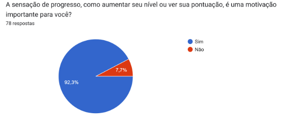
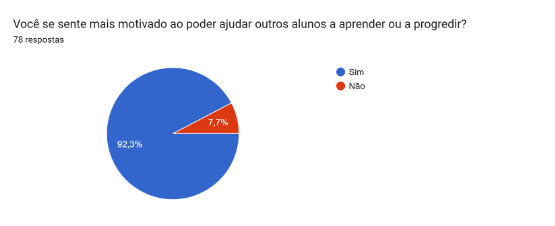
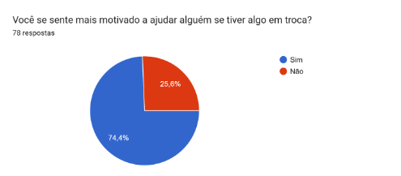
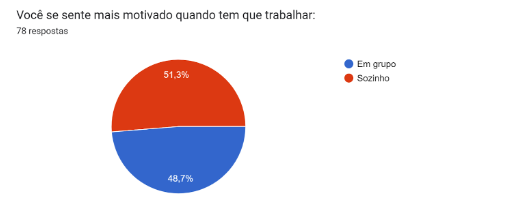
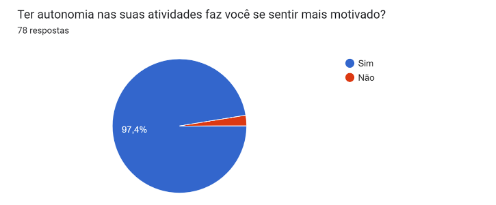
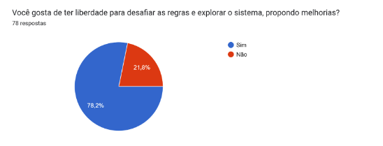

**Integrantes do Grupo:**

| Mat.      | Nome                                   | Responsabilidade          |
| :-------- | :------------------------------------- | :------------------------ |
| 231027032 | ARTHUR EVANGELISTA DE OLIVEIRA         | Criação do formulário     |
| 232001649 | DAVID WILLIAM LEMOS FERREIRA           | Análise do formulário     |
| 232013980 | GABRIEL ANDRADE MAGIOLI                | Análise do formulário     |
| 231038644 | GIOVANA DE SOUZA FONTES                | Análise do formulário     |
| 222008691 | GUSTAVO RIBEIRO LINHARES               | Criação do formulário     |
| 221022604 | JOÃO VICTOR DA SILVA BATISTA DE FARIAS | Análise do formulário     |
| 231035455 | LETICIA MARIA DE JESUS LOPES           | Criação do formulário     |
| 231026886 | SOPHIA SOUZA DA SILVA                  | Análise do formulário     |
| 231011865 | WILLIAN WAGNER XAVIER RAMOS DA SILVA   | Criação do formulário     |
| 231038303 | YAN MATHEUS SANTA BRIGIDA DE AGUIAR    | Criação do formulário     |

**Histórico de Revisões**

| Versão | Data | Descrição da Alteração | Nome(s) Integrante(s) |
| :----: | :--: | :--------------------: | :-------------------: |
| 1.0 | 24/11/2024 | Criação do documento | Arthur, Gustavo, Letícia, Willian, Yan |

# Relatório do Formulário de Gamificação

Universidade de Brasília  
Campus UnB Gama  
Faculdade de Ciências e Tecnologias em Engenharia  

**Grupo 6 - Wunjo**  
Brasília, 2024  

---

## Objetivo do Documento

Este documento relata a análise das respostas obtidas no formulário de identificação de perfis de jogadores (players), desenvolvido para orientar a elaboração da gamificação de um projeto na FCTE, UnB Gama. O formulário contou com **78 respostas**.

---

## Ferramenta Hexad

O estudo baseia-se na **ferramenta Hexad**, que define seis tipos de perfis de jogadores:

1. **Free Spirit (Espírito Livre)**  
   Motivados pela liberdade de ação e expressão.
2. **Philanthropist (Filantropo)**  
   Desejam ajudar os outros sem esperar retorno.
3. **Socializer (Socializador)**  
   Valorizam a interação social e o trabalho em equipe.
4. **Achiever (Realizador)**  
   Buscam progresso pessoal e excelência.
5. **Disruptor (Revolucionário)**  
   Desafiam o status quo, propondo mudanças.
6. **Player (Jogador)**  
   Focados em recompensas tangíveis e reconhecimento.

---

## Resultados

### 1. **Achiever (Realizador)**
- **92,3%** consideram o progresso e a conquista de metas como importantes.

Imagem 1: Gráfico de respostas Achiever

### 2. **Philanthropist (Filantropo)**
- **92,3%** sentem-se motivados ao ajudar os outros.
  

Imagem 2: Gráfico de respostas Philantropist

### 3. **Player (Jogador)**
- **74,4%** valorizam recompensas por ajudar.

Imagem 3: Gráfico de respostas Player

### 4. **Socializer (Socializador)**
- **51,3%** preferem trabalhar em grupo.

Imagem 4: Gráfico de respostas Socializer

### 5. **Free Spirit (Espírito Livre)**
- **97,4%** sentem-se motivados pela autonomia.

Imagem 5: Gráfico de respostas Free Spirit

### 6. **Disruptor (Revolucionário)**
- **78,2%** gostam de desafiar as regras e propor melhorias.
  

Imagem 6: Gráfico de respostas Disruptor

---

## Perfis Definidos para a Gamificação

A equipe Wunjo definiu os perfis de jogadores que fundamentarão a gamificação:

1. **Free Spirit (Espírito Livre)**  
   - Destaque com **97,4%** de respostas favoráveis.
   - Base principal para a gamificação, por alinhar-se à proposta de uma plataforma de tutoria livre.

2. **Player (Jogador)**  
   - **74,4%** de respostas positivas.
   - Essencial para incentivar a competitividade, com recompensas e ranqueamento.

3. **Philanthropist (Filantropo)**  
   - **92,3%** de respostas positivas.  
   - Apesar da relevância, não será prioridade.

### Menção: Socializer (Socializador)
- Apesar de destaque na última questão (**41%**), foi descartado devido à resistência dos estudantes à interação social.

---

## Conclusão

Os dados apontam que a gamificação deve priorizar os perfis **Free Spirit** e **Player**, enquanto os perfis **Philanthropist** e **Socializer** exigem abordagens específicas. A aplicação será estruturada para explorar a liberdade e recompensas tangíveis, alinhando-se às preferências do público-alvo.
